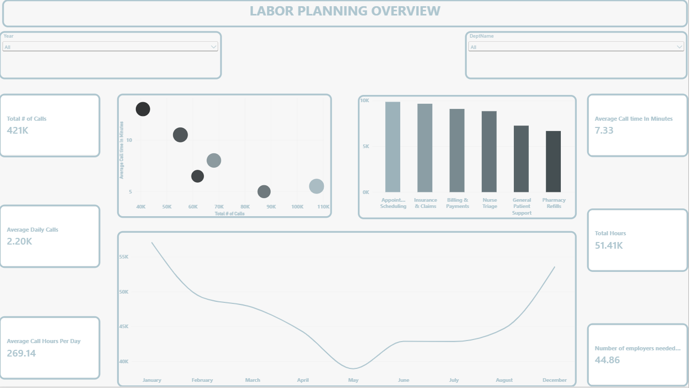
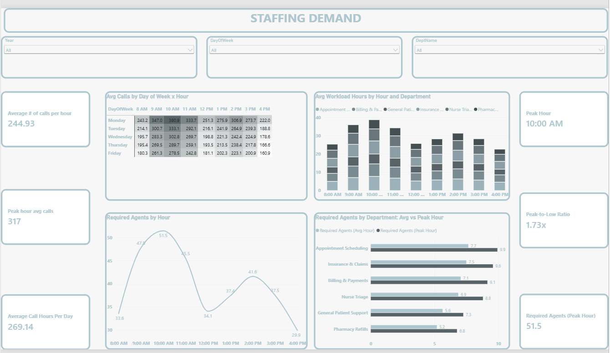

# Call Center Labor Demand Dashboard (Power BI)

A Power BI dashboard that answers one question: **how many agents does a call center need, and when?**

## Dashboard

### Page 1: Labor Overview

Total calls, average call time, total hours, calls by department and the monthly trend.

### Page 2: Staffing Demand

Peak hour, a calls heatmap by day and hour, workload by department, and the number of agents needed each hour.

## About the Data
- 421,032 calls from Dec 2025 to Aug 2026 (weekdays, 8 AM to 5 PM)
- 6 departments, each with its own hourly wage
- The dataset is not included in this repository

## Key Insights
- Calls peak at **10 AM**, 1.7x busier than 4 PM
- **Mondays** are 36% busier than Fridays
- About **52 agents** are needed at peak vs about 30 at 4 PM
- **Nurse Triage** is 10% of calls but 29% of labor cost
- January was 32% busier than summer

## Recommendations
- Stagger shifts to cover the 9 to 11 AM rush
- Add part-time staff on Mondays
- Cross-train low-cost departments to share the load

## Tools
Power BI, Power Query, DAX

## Author
Mathew Olajide | www.linkedin.com/in/moolajide1906
